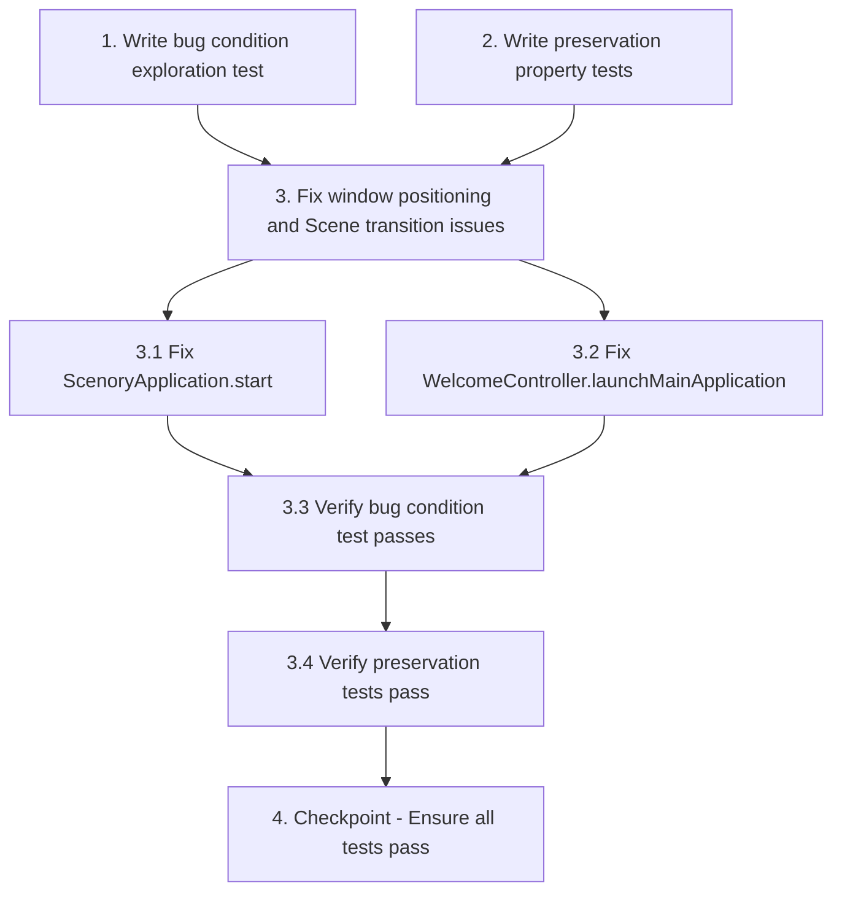

# Implementation Plan

## Overview

This implementation plan addresses the JavaFX window positioning bug where the title bar becomes inaccessible after restoring from maximized state. The fix involves establishing valid restored bounds before maximizing in ScenoryApplication.start() and properly handling Scene transitions in WelcomeController.launchMainApplication().

## Tasks

- [x] 1. Write bug condition exploration test
  - **Property 1: Bug Condition** - Window Title Bar Inaccessible After Restore From Maximized
  - **CRITICAL**: This test MUST FAIL on unfixed code - failure confirms the bug exists
  - **DO NOT attempt to fix the test or the code when it fails**
  - **NOTE**: This test encodes the expected behavior - it will validate the fix when it passes after implementation
  - **GOAL**: Surface counterexamples that demonstrate the bug exists
  - **Scoped PBT Approach**: For deterministic bugs, scope the property to the concrete failing case(s) to ensure reproducibility
  - Test implementation: Launch application that calls `stage.setMaximized(true)` without prior `stage.centerOnScreen()` call, wait for initialization, simulate restore button click, measure window Y coordinate
  - Test Scene transition bug: Launch application maximized, trigger template button to transition from welcome-view to main-view (creating new Scene while maximized), simulate restore button click, measure window Y coordinate
  - The test assertions should verify:
    - Window Y coordinate is >= 0 after restore (expected behavior)
    - Title bar is positioned within visible screen area (Y >= 0 and Y < screen.height)
    - Title bar controls (minimize, maximize, close) are accessible within screen bounds
  - Run test on UNFIXED code (current ScenoryApplication.java and WelcomeController.java)
  - **EXPECTED OUTCOME**: Test FAILS with window Y coordinate < 0 (typically -8 or -11), confirming negative offset issue
  - Document counterexamples found:
    - Example 1: Application starts maximized without centerOnScreen(), restore yields Y = -8 (title bar above screen top)
    - Example 2: Scene transition while maximized in WelcomeController.launchMainApplication(), restore yields Y = -11 (title bar inaccessible)
    - Example 3: Multiple maximize/restore cycles continue to use Y = -8 (persistent negative offset)
  - Mark task complete when test is written, run, and failure is documented
  - _Requirements: 1.1, 1.2, 1.3, 1.4_

- [x] 2. Write preservation property tests (BEFORE implementing fix)
  - **Property 2: Preservation** - Non-Startup Window Operations Preserved
  - **IMPORTANT**: Follow observation-first methodology
  - Observe behavior on UNFIXED code for non-buggy inputs (window operations that don't involve initial startup maximization or Scene transitions while maximized):
    - Manual window move: Move window to position (X, Y) in normal state, observe position is preserved
    - Manual window resize: Resize window to (W, H) in normal state, observe size is preserved
    - Minimize/restore: Minimize then restore, observe position unchanged
    - Multiple maximize/restore with valid bounds: Start in normal state, maximize, restore, observe returns to original position
  - Write property-based tests capturing observed behavior patterns:
    - Property 2a: For all valid window positions (X >= 0, Y >= 0) within screen bounds, manually moving window to (X, Y) in normal state results in window remaining at (X, Y)
    - Property 2b: For all valid window sizes (W >= minWidth, H >= minHeight), manually resizing window to (W, H) in normal state results in window remaining at (W, H)
    - Property 2c: For all valid starting positions, maximize followed by restore returns window to starting position
    - Property 2d: Minimize/restore is an identity operation for window position (position unchanged)
    - Property 2e: After establishing valid restored bounds, subsequent maximize/restore cycles use same restored position
  - Property-based testing generates many test cases for stronger guarantees (various positions, sizes, screen configurations)
  - Run tests on UNFIXED code
  - **EXPECTED OUTCOME**: Tests PASS (this confirms baseline behavior to preserve)
  - Mark task complete when tests are written, run, and passing on unfixed code
  - _Requirements: 3.1, 3.2, 3.3, 3.4, 3.5_

- [ ] 3. Fix window positioning and Scene transition issues

  - [x] 3.1 Fix ScenoryApplication.start() to establish valid restored bounds before maximizing
    - **File**: `src/main/java/com/example/scenory/ScenoryApplication.java`
    - **Function**: `start(Stage stage)`
    - **Change 1**: Insert `stage.centerOnScreen();` after `stage.setScene(scene);` (currently line 61) and before `stage.setMaximized(true);` (currently line 67)
    - **Rationale**: centerOnScreen() calculates screen dimensions and positions window at center with valid positive X/Y coordinates, establishing proper restored bounds before maximizing
    - **Alternative approach**: Instead of centerOnScreen(), can set explicit position: `stage.setX(100); stage.setY(100);` before maximizing for more control
    - **Change 2**: Ensure `stage.show();` (currently line 68) occurs before or after maximize (current order is correct)
    - **Verification**: After this change, stage should have X >= 0 and Y >= 0 as restored bounds
    - _Bug_Condition: isBugCondition(input) where input.startedMaximized == true AND input.centerOnScreenCalled == false_
    - _Expected_Behavior: After restore, window Y coordinate >= 0 AND title bar visible within screen viewport_
    - _Preservation: Manual window operations (move, resize), minimize/restore, subsequent maximize/restore with valid bounds remain unchanged_
    - _Requirements: 1.1, 2.1, 2.4_

  - [x] 3.2 Fix WelcomeController.launchMainApplication() to preserve valid window bounds during Scene transition
    - **File**: `src/main/java/com/example/scenory/controller/WelcomeController.java`
    - **Function**: `launchMainApplication(Project project)`
    - **Change 1**: Store maximized state before Scene transition, temporarily unmaximize, transition Scene, then re-maximize
      ```java
      // Around line 213-226 (before stage.setScene(newScene))
      boolean wasMaximized = stage.isMaximized();
      if (wasMaximized) {
          stage.setMaximized(false);  // Temporarily restore to normal
      }
      stage.setScene(newScene);  // Transition Scene with valid bounds
      if (wasMaximized) {
          stage.setMaximized(true);   // Re-maximize
      }
      ```
    - **Rationale**: Creating a new Scene and setting it on a maximized Stage can cause Windows to update saved bounds with invalid coordinates. Temporarily restoring before the transition preserves valid bounds.
    - **Change 2**: Remove the redundant `stage.setMaximized(true);` call at line 226 if it exists after implementing Change 1 (the re-maximize is now conditional)
    - **Alternative approach**: Manually save and restore bounds:
      ```java
      double x = stage.getX();
      double y = stage.getY();
      double width = stage.getWidth();
      double height = stage.getHeight();
      stage.setScene(newScene);
      stage.setX(x);
      stage.setY(y);
      stage.setWidth(width);
      stage.setHeight(height);
      ```
    - **Verification**: After Scene transition and subsequent restore from maximized, window Y coordinate should be >= 0
    - _Bug_Condition: isBugCondition(input) where input.sceneTransitionWhileMaximized == true AND input.restoredBoundsPreserved == false_
    - _Expected_Behavior: After Scene transition and restore, window Y coordinate >= 0 AND title bar accessible_
    - _Preservation: Scene transitions in normal (non-maximized) state, manual window operations remain unchanged_
    - _Requirements: 1.3, 2.3, 2.4_

  - [x] 3.3 Verify bug condition exploration test now passes
    - **Property 1: Expected Behavior** - Window Title Bar Accessible After Restore
    - **IMPORTANT**: Re-run the SAME test from task 1 - do NOT write a new test
    - The test from task 1 encodes the expected behavior
    - When this test passes, it confirms the expected behavior is satisfied
    - Run bug condition exploration test from step 1
    - Verify all test assertions pass:
      - Window Y coordinate >= 0 after restore from maximized state
      - Title bar positioned within visible screen area
      - Title bar controls accessible within screen bounds
      - Scene transition followed by restore yields Y >= 0
    - **EXPECTED OUTCOME**: Test PASSES (confirms bug is fixed)
    - Document that counterexamples from step 1 are now resolved:
      - Startup maximize now yields Y >= 0 after restore (not Y = -8)
      - Scene transition while maximized now preserves valid bounds (not Y = -11)
      - Multiple maximize/restore cycles maintain Y >= 0 (not persistent negative offset)
    - _Requirements: 2.1, 2.2, 2.3, 2.4_

  - [x] 3.4 Verify preservation tests still pass
    - **Property 2: Preservation** - Non-Startup Operations Unchanged
    - **IMPORTANT**: Re-run the SAME tests from task 2 - do NOT write new tests
    - Run preservation property-based tests from step 2:
      - Property 2a: Manual window move preservation
      - Property 2b: Manual window resize preservation
      - Property 2c: Multiple maximize/restore with valid bounds preservation
      - Property 2d: Minimize/restore preservation
      - Property 2e: Subsequent maximize/restore stability
    - **EXPECTED OUTCOME**: All tests PASS (confirms no regressions)
    - Confirm all preservation properties hold:
      - Manual moves to (X, Y) are preserved exactly
      - Manual resizes to (W, H) are preserved exactly
      - Maximize/restore from normal state returns to original position
      - Minimize/restore does not change position
      - After establishing valid bounds, subsequent restores use same position
    - Verify across multiple screen configurations if possible (single monitor, dual monitor, different resolutions)
    - _Requirements: 3.1, 3.2, 3.3, 3.4, 3.5_

- [ ] 4. Checkpoint - Ensure all tests pass
  - Run complete test suite:
    - Bug condition exploration test (Property 1) should PASS
    - All preservation tests (Property 2a-2e) should PASS
  - Verify manually:
    - Launch application, observe it starts maximized with no visible issues
    - Click restore button, verify title bar is visible and accessible (Y >= 0)
    - Manually move window, maximize, restore, verify returns to manual position
    - Click template button to transition to main view, maximize, restore, verify title bar accessible
  - If any test fails or manual verification reveals issues:
    - Re-examine root cause
    - Review changes in ScenoryApplication.start() and WelcomeController.launchMainApplication()
    - Check for race conditions or timing issues with centerOnScreen() and Scene transitions
    - Consider alternative approaches (explicit X/Y setting, manual bounds preservation)
  - If questions or unexpected behaviors arise, ask the user for guidance
  - Mark complete when all automated tests pass and manual verification confirms bug is fixed with no regressions


## Task Dependency Graph



```json
{
  "waves": [
    {
      "name": "Wave 1: Test Creation (Before Fix)",
      "tasks": ["1", "2"]
    },
    {
      "name": "Wave 2: Implementation",
      "tasks": ["3.1", "3.2"]
    },
    {
      "name": "Wave 3: Verification",
      "tasks": ["3.3", "3.4"]
    },
    {
      "name": "Wave 4: Final Checkpoint",
      "tasks": ["4"]
    }
  ]
}
```

## Notes

- Task 1 (exploration test) MUST be written and run on UNFIXED code BEFORE implementing the fix
- Task 2 (preservation tests) MUST be written and run on UNFIXED code BEFORE implementing the fix
- The exploration test is EXPECTED to FAIL on unfixed code - this confirms the bug exists
- The preservation tests are EXPECTED to PASS on unfixed code - this establishes baseline behavior
- Task 3.3 re-runs the SAME test from Task 1 (do not write a new test)
- Task 3.4 re-runs the SAME tests from Task 2 (do not write new tests)
- Property-based testing is recommended for stronger guarantees in preservation tests
- Testing should cover multiple screen configurations if possible (single/dual monitor, different resolutions)
